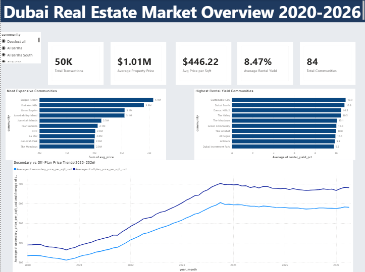
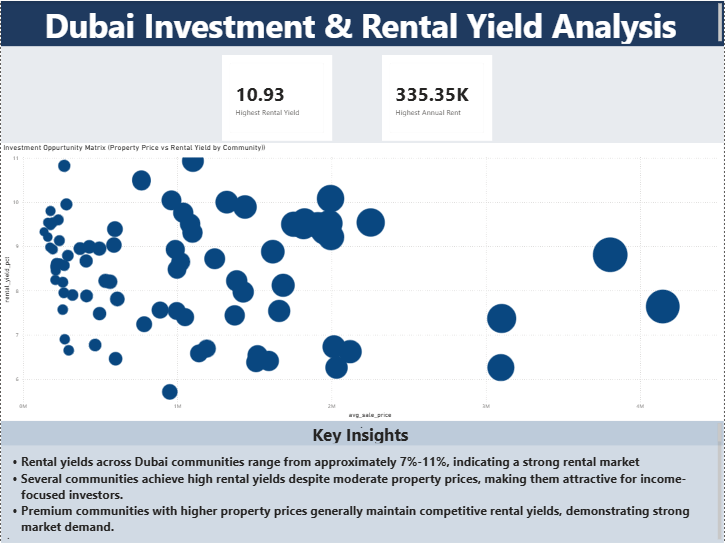

# Dubai Real Estate Analytics Dashboard

## About This Project

As part of my transition into Data Analytics, I wanted to work on a project that connected with an industry I was already familiar with.

Having worked in a real estate sales role, I understood how factors such as property prices, rental returns, and community demand influence investment decisions. This project gave me an opportunity to explore those questions using data.

Using SQL and Power BI, I analyzed Dubai's real estate market to uncover trends in property prices, rental yields, transaction activity, and investment opportunities across different communities.

The goal was to build a dashboard that not only visualizes market trends but also helps investors identify attractive real estate opportunities.

## Project Objectives

- Analyze Dubai property market trends
- Compare secondary and off-plan market performance
- Identify communities with the highest property prices
- Identify communities with the highest rental yields
- Evaluate investment opportunities using price and rental data
- Build an interactive Power BI dashboard

- ## Tools Used

- SQL (MySQL)
- Power BI
- DAX
- GitHub

- The dashboard consists of two pages:

### 1. Executive Overview
Provides a high-level view of Dubai's real estate market through:

- Total Transactions
- Average Property Price
- Average Price per Sqft
- Average Rental Yield
- Total Communities
- Top 10 Most Expensive Communities
- Top 10 Highest Rental Yield Communities
- Secondary vs Off-Plan Price Trends (2020-2026)

### 2. Investment Analysis
Focused on investment opportunities using:

-- Property Price vs Rental Yield Scatter Plot
- Annual Rental Income Bubble Analysis
- Community-Level Rental Yield Comparison
- Investment Opportunity Insights

- ## Key Findings

- Rental yields across Dubai communities range approximately between 7% and 11%.
- Several communities offer strong rental returns despite moderate property prices.
- Premium communities maintain healthy rental yields while commanding significantly higher property values.
- Secondary and off-plan property prices have shown strong growth trends from 2020 onwards.
- Certain communities provide attractive investment opportunities by balancing affordability and rental income potential.

- ## Skills Demonstrated

### SQL
- Data Cleaning
- Aggregations
- Joins
- Views
- Trend Analysis
- Rental Yield Analysis

### Power BI
- Data Modeling
- DAX Measures
- KPI Cards
- Interactive Visualizations
- Dashboard Design
- Business Insights

### Business Analysis
- Investment Opportunity Assessment
- Real Estate Market Analysis
- Rental Yield Evaluation
- Trend Identification

- ## Dataset

The project uses Dubai real estate market data covering:

- Secondary Property Sales
- Rental Transactions
- Off-Plan Property Sales
- Community-Level Property Prices

The dataset contains approximately:

- 50,000+ Secondary Sales Records
- 25,000+ Rental Records
- 12,000+ Off-Plan Records

## Dashboard Preview

### Executive Overview

### Investment Analysis

## Project Structure

Dubai-Real-Estate-Analytics/

├── README.md

├── SQL Queries/

├── Power BI Dashboard/

├── Screenshots/

└── Documentation/

## Future Improvements

- Add geographic analysis using maps
- Integrate metro accessibility analysis

- ## Author

Thithiksha S Anand

Engineering graduate transitioning into Data Analytics with experience in real estate sales and business operations.

Passionate about transforming data into actionable business insights using SQL and Power BI.
